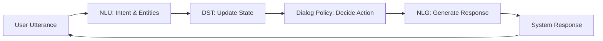
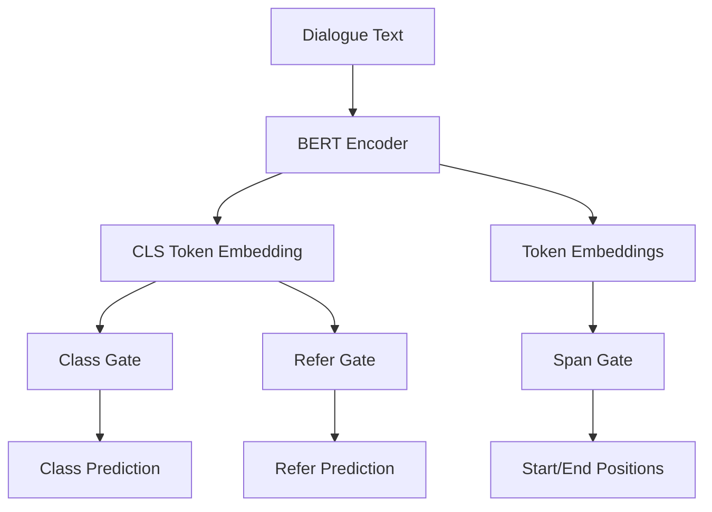

# Understanding Dialog State Tracking with TripPy: A Deep Dive into the Triple Copy Strategy

## Table of Contents
1. [What is Dialog State Tracking?](#1-what-is-dialog-state-tracking)
2. [Why Do We Need DST?](#2-why-do-we-need-dst)
3. [DST and the Role of NLU](#3-dst-and-the-role-of-nlu)
4. [Transformers and Where DST Fits](#4-transformers-and-where-dst-fits)
5. [The TripPy Architecture](#5-the-trippy-architecture)
6. [The Dataset: A Concrete Example](#6-the-dataset-a-concrete-example)
7. [The Ablation Study](#7-the-ablation-study)
8. [How One Example Propagates Through the Network](#8-how-one-example-propagates-through-the-network)
9. [What Are the Gates and Why Do We Need Them?](#9-what-are-the-gates-and-why-do-we-need-them)
10. [Loss Computation: Teaching the Model](#10-loss-computation-teaching-the-model)
11. [ConvLab3: The Data Engine](#11-convlab3-the-data-engine)
12. [Real-World Applications for DST and BERT](#12-real-world-applications-for-dst-and-bert)

---

## 1. What is Dialog State Tracking?

Imagine you're booking a restaurant through a chatbot. Over several turns, you say:

> **Turn 1:** *"I want Italian food."*
> **Turn 2:** *"For 2 people, please."*
> **Turn 3:** *"Actually, make it 4 people."*
> **Turn 4:** *"And I need parking."*

At every turn, the system needs to remember what you've said so far. **Dialog State Tracking (DST)** is the task of maintaining a structured representation of the user's goal throughout a conversation.

The "state" is typically stored as **slot-value pairs**:

| Slot | Value after Turn 1 | Value after Turn 4 |
|------|-------------------|-------------------|
| `restaurant-food` | Italian | Italian |
| `restaurant-num_people` | 2 | **4** |
| `hotel-parking` | none | **true** |

At each turn, the DST model looks at the conversation so far and updates these pairs. It's like a dynamic database that lives inside the conversation.

---

## 2. Why Do We Need DST?

Without DST, a chatbot would have **no memory**. Every turn would be processed in isolation, like talking to someone with amnesia. DST solves several critical problems:

| Problem | How DST Helps |
|---------|--------------|
| **Memory** | Remembers what the user said 5 turns ago |
| **Coreference** | Understands "the hotel I mentioned earlier" |
| **Correction** | Handles changes: "Actually, make it 4 people" |
| **Multi-domain** | Tracks hotel AND restaurant slots simultaneously |
| **API calls** | Provides structured data to query booking systems |

DST is the bridge between **natural language** (messy, ambiguous) and **structured data** (clean, actionable).

---

## 3. DST and the Role of NLU

You might wonder: *"Isn't DST just another NLU task?"*

Not exactly. Natural Language Understanding (NLU) and Dialog State Tracking serve different but complementary roles in a conversational system:

| Aspect | NLU | DST |
|--------|-----|-----|
| **Scope** | Single user turn | Entire dialog history |
| **Output** | Intent labels, entities, slot values | Updated slot-value state across turns |
| **Goal** | Understand what the user means now | Track what the user wants over time |
| **Challenge** | Interpreting a single utterance | Handling corrections, references, and context across turns |
| **Use case** | Intent classification, entity extraction | API calls, booking systems, task completion |

NLU answers questions like:
- "What is the user asking for?"
- "Which entities appear in this sentence?"

DST answers questions like:
- "What is the current booking state?"
- "Has the user changed their mind?"
- "Does this turn update an existing slot or introduce a new one?"

This is why DST is a separate module: you can feed NLU output into DST, but DST also needs previous turns, prior state, and reference resolution.

---

## 4. Transformers and Where DST Fits

### The Transformer Revolution

Transformers, introduced in "Attention Is All You Need" (2017), revolutionized NLP by using **self-attention** to process sequences in parallel. BERT (2018) brought bidirectional context understanding. For DST, this means:

- **Contextualized embeddings**: The word "Italian" is understood differently in "I want Italian food" vs. "I'm Italian"
- **Long-range dependencies**: The model can connect a mention in turn 1 to a reference in turn 8
- **Pre-trained knowledge**: BERT already knows about restaurants, hotels, and booking concepts

### Where DST Fits in the Pipeline



DST sits between **understanding** (NLU) and **decision-making** (Policy). It takes the raw understanding and turns it into a structured, persistent state.

---

## 5. The TripPy Architecture

TripPy ("Triple Copy Strategy for Value Independent Neural Dialog State Tracking") is a BERT-based DST model that uses **three copy mechanisms** instead of a fixed value list:



### The Three Copy Mechanisms

1. **Span Prediction**: Extract values directly from the user's text (e.g., "Italian" from "I want Italian food")
2. **System Inform Memory**: Copy values the system previously mentioned (e.g., "The hotel has free parking")
3. **Slot-to-Slot Referral**: Copy values from another slot (e.g., "The same area as the hotel" → copy `hotel-area` to `restaurant-area`)

This is **value-independent**: the model doesn't need a predefined list of possible values. It extracts everything on-the-fly from the conversation context.

---

## 6. The Dataset: A Concrete Example

We use **SimpleMultiWOZ 2.1** in ConvLab3's unified format. Let's look at one training example:

### The Conversation

> **System:** "Welcome to the Cambridge restaurant system. What kind of food would you like?"
> **User:** "I want Italian food in the centre."
> **System:** "There are several Italian restaurants in the centre. How many people?"
> **User:** "For 2 people."

### The Ground Truth State

| Slot | Value | Class Type |
|------|-------|-----------|
| `restaurant-food` | Italian | `copy_value` |
| `restaurant-area` | centre | `copy_value` |
| `restaurant-book_people` | 2 | `copy_value` |
| `hotel-parking` | none | `none` |
| `taxi-destination` | none | `none` |

### The Training Example Structure

Each example is a `DSTExample` object:

```python
{
    "guid": "MUL0001-turn_2",
    "text_a": "I want Italian food in the centre",      # User utterance
    "text_b": "There are several Italian restaurants...", # System utterance
    "history": ["Welcome...", "I want Italian food..."], # Previous turns
    "class_label": {
        "restaurant-food": "copy_value",
        "restaurant-area": "copy_value",
        "restaurant-book_people": "copy_value",
        ...
    },
    "start_pos": {
        "restaurant-food": 3,    # "Italian" starts at token 3
        "restaurant-area": 5,    # "centre" starts at token 5
        ...
    },
    "end_pos": {
        "restaurant-food": 3,    # "Italian" ends at token 3
        "restaurant-area": 5,    # "centre" ends at token 5
        ...
    },
    "inform_slot": {
        "restaurant-food": 0,    # System didn't inform this
        "restaurant-area": 0,
        ...
    },
    "diag_state": {
        "restaurant-food": "none",    # Previous turn's state
        "restaurant-area": "none",
        ...
    },
    "refer_label": {
        "restaurant-food": "none",    # Not referring to another slot
        ...
    }
}
```

### Class Types Explained

| Class | Meaning | Example |
|-------|---------|---------|
| `none` | Slot not mentioned | "I don't mention parking" |
| `dontcare` | No preference | "Any area is fine" |
| `copy_value` | Extract from text | "I want **Italian** food" |
| `true` / `false` | Boolean slots | "I need **parking**" → `true` |
| `refer` | Copy from another slot | "Same area as the hotel" |
| `inform` | System provided value | "The hotel is in the centre" |
| `request` | User is asking | "What's the phone number?" |

---

## 7. The Ablation Study

An **ablation study** systematically removes parts of a model to understand their contribution. We're testing three conditions:

| Condition | What We Include | What We Remove | Purpose |
|-----------|----------------|----------------|---------|
| **Full Features** | User turn + History + `inform_slot` + `diag_state` | Nothing | Baseline: best possible performance |
| **No Auxiliary** | User turn + History | `inform_slot` + `diag_state` | Test if auxiliary features help |
| **No History + No Aux** | Current user turn only | History + `inform_slot` + `diag_state` | Test if context matters |

### Why This Matters

- **History**: Does the model need to see previous turns, or is the current turn enough?
- **Inform slot**: Does knowing what the system said help predict user slots?
- **Dialog state**: Does knowing the previous state help predict updates?

If performance drops significantly when removing a feature, that feature is **critical**.

---

## 8. How One Example Propagates Through the Network

Let's trace `restaurant-food` = "Italian" through the network:

### Step 1: BERT Encoding

```python
# Input tokens: [CLS] i want italian food in the centre [SEP]
outputs = bert(input_ids, attention_mask=input_mask)
sequence_output = outputs[0]  # (batch=1, seq_len=10, hidden=256)
pooled_output = outputs[1]      # (batch=1, hidden=256) - [CLS] token
```

### Step 2: Auxiliary Features (if enabled)

```python
# inform_slot: which slots did the system inform?
inform_labels = [0, 0, 0, 0, ...]  # 30 slots, all 0 in this turn

# diag_state: what was the previous state?
diag_state_labels = [0, 0, 0, ...]  # All "none" at turn 1

# Concatenate to CLS embedding
pooled_output_aux = torch.cat((pooled_output, inform_projection(inform_labels), ds_projection(diag_state_labels)), dim=1)
# Shape: (1, 256 + 30 + 30) = (1, 316)
```

### Step 3: Gate Predictions

```python
# Class gate: What type of update?
class_logits = class_restaurant_food(pooled_output_aux)
# Output: (1, 8) - scores for [none, dontcare, copy_value, true, false, refer, inform, request]
# Prediction: copy_value (index 2)

# Span gate: Where in the text?
token_logits = span_restaurant_food(sequence_output)
start_logits, end_logits = token_logits.split(1, dim=-1)
# start_logits: (1, 10) - high score at position 3 ("Italian")
# end_logits: (1, 10) - high score at position 3

# Refer gate: Which other slot?
refer_logits = refer_restaurant_food(pooled_output_aux)
# Output: (1, 31) - high score at index 0 ("none", meaning no referral)
```

### Step 4: Loss Computation

```python
# Class loss: Did we predict the right type?
class_loss = CrossEntropyLoss(class_logits, target="copy_value")

# Span loss: Did we point to the right tokens?
start_loss = CrossEntropyLoss(start_logits, target=3)  # "Italian" at position 3
end_loss = CrossEntropyLoss(end_logits, target=3)
token_loss = (start_loss + end_loss) / 2

# Refer loss: Did we correctly say "no referral"?
refer_loss = CrossEntropyLoss(refer_logits, target=0)

# Combined loss
per_example_loss = 0.8 * class_loss + 0.1 * token_loss + 0.1 * refer_loss
```

---

## 9. What Are the Gates and Why Do We Need Them?

### The Three Gates

A "gate" is simply a small neural network head that makes a specific prediction. We need **one set of gates per slot** because each slot has independent behavior:

```python
# In modeling_dst.py __init__:
for slot in self.slot_list:
    self.add_module("class_" + slot, nn.Linear(hidden_size + aux_dims, num_class_types))
    self.add_module("span_" + slot, nn.Linear(hidden_size, 2))
    self.add_module("refer_" + slot, nn.Linear(hidden_size + aux_dims, num_slots + 1))
```

| Gate | Input | Output | Why It Exists |
|------|-------|--------|---------------|
| **Class** | CLS + aux features | 8 class scores | Decides *how* the slot is updated |
| **Span** | All token embeddings | Start & end positions | Finds *where* the value is in text |
| **Refer** | CLS + aux features | Which slot to copy from | Resolves *coreferences* |

### Why Separate Gates?

1. **Different inputs**: Class/Refer use CLS (sentence-level), Span uses all tokens
2. **Different outputs**: Class predicts categories, Span predicts positions, Refer predicts slot indices
3. **Independent learning**: Each slot learns its own patterns ("food" vs. "parking" behave differently)

---

## 10. Loss Computation: Teaching the Model

The loss is a **weighted teacher** that tells the model what it got wrong:

```python
# Per-slot, per-example loss
if refer_index > -1:
    loss = 0.8 * class_loss + 0.1 * token_loss + 0.1 * refer_loss
else:
    loss = 0.8 * class_loss + 0.2 * token_loss
```

### Why These Weights?

- **Class (80%)**: Getting the update type right is most important. If you predict `none` when it should be `copy_value`, everything else is wrong.
- **Span (10%)**: Only matters when class is `copy_value`. The clever `torch.cat((start_logits, end_logits), 1)` trick forces the model to consider both positions jointly.
- **Refer (10%)**: Only matters when class is `refer`. Handles cases like "the same area."

### Masking: Don't Penalize Irrelevant Errors

```python
# If class is NOT copy_value, don't compute span loss
token_is_pointable = (start_pos > 0).float()
if not token_loss_for_nonpointable:
    token_loss *= token_is_pointable  # Zero out if not copy_value

# If class is NOT refer, don't compute refer loss
token_is_referrable = (class_label == refer_index).float()
if not refer_loss_for_nonpointable:
    refer_loss *= token_is_referrable
```

This prevents the model from being confused by irrelevant tasks.

---

## 11. ConvLab3: The Data Engine

**ConvLab3** is an open-source toolkit for building and evaluating dialog systems. For our purposes, it provides:

| Function | What It Does |
|----------|-------------|
| `load_dataset("simplemultiwoz21")` | Loads the raw dialog data |
| `load_ontology("simplemultiwoz21")` | Returns all domains, slots, and intents |
| `load_dst_data(...)` | Extracts turn-level DST labels |

### Why We Need It

The `unified` task format doesn't read from local JSON files. Instead, it calls ConvLab3's Python API to:

1. **Generate the slot list** automatically from the ontology
2. **Load dialogues** with proper train/dev/test splits
3. **Extract labels** including dialog acts, states, and turns

```python
# From dataset_unified.py:
from convlab.util import load_dataset, load_ontology, load_dst_data

ontology = load_ontology("simplemultiwoz21")
slot_list = get_ontology_slots(ontology)  # 30+ slots
dataset = load_dataset("simplemultiwoz21")
examples = load_dst_data(dataset, "train", "user", dialogue_acts=True)
```

Without ConvLab3, the `unified` format has no data source. That's why we set:
```bash
set PYTHONPATH=C:\Users\Ahmed\Desktop\HHU REPOs\convlab3;%PYTHONPATH%
```

---

## 12. Real-World Applications for DST and BERT

DST and BERT are both highly relevant for practical conversational AI systems.

### 1. **Conversational AI and Voice Assistants**
- Tracking user preferences across turns
- Handling corrections such as "No, I meant 4 people"
- Turning slot-value state into API calls for booking or reservation systems

### 2. **Customer Service and Support Bots**
- Extracting order numbers, issue categories, and account details
- Maintaining a session state that human agents can inspect or continue
- Reducing repeated questions by remembering past answers

### 3. **Task-Oriented Dialogue Systems**
- Restaurant booking, travel planning, hotel reservation
- Smart home control where the system manages multiple device settings
- Healthcare intake dialogs that need structured patient data

### 4. **BERT for Real-Life NLU Tasks**
BERT is useful in many practical applications beyond slot tracking:
- **Intent classification**: identifying the user's goal in a turn
- **Named entity recognition**: extracting names, dates, locations, and quantities
- **Semantic search**: matching questions with the best knowledge base answer
- **FAQ systems**: finding the most relevant response to user queries
- **Document understanding**: extracting meaning from emails, forms, and reports

### 5. **Where BERT Helps Most**
- **Virtual agents** for customer support and booking
- **Email and chat triage** in business workflows
- **Search and recommendation** with natural language queries
- **Form understanding** for insurance, finance, and healthcare
- **Semantic matching** in help desks and knowledge retrieval

BERT provides a strong foundation for the NLU part of the pipeline, while DST provides the structured state that makes the system actionable.

---

## 13. modeling_dst.py TODO Summary

This section briefly explains the purpose of each TODO block in `modeling_dst.py`.

- `TODO DST_TASK1 TripPy gates`: defines one gate head per slot for class prediction, span prediction, and refer prediction. The class and refer heads use the pooled `[CLS]` embedding plus auxiliary features when enabled, while the span head uses token-level embeddings.
- `TODO 2a`: computes per-slot class logits from the CLS-based pooled output (optionally concatenated with `inform_slot` and `diag_state` projections). This head predicts the slot update type such as `copy_value`, `none`, `refer`, or `inform`.
- `TODO 2b`: computes span logits from token embeddings for each slot. It predicts start and end positions jointly by splitting the span head output and applying dropout to each token-level score.
- `TODO 2c`: computes refer logits from the CLS-based pooled output (plus aux features if used). This head predicts whether the slot should copy from another slot or not.
- `TODO 2d`: computes token/span loss using cross-entropy on the target start/end positions. The two losses are averaged and optionally masked when the current class is not pointable.
- `TODO 2e`: computes class loss using cross-entropy between class logits and the true per-slot class label.
- `TODO 2f`: combines class, token, and refer losses into a final per-example loss. The class loss is weighted by `class_loss_ratio`, while the remaining loss mass is split between token and refer loss when the `refer` class exists.
- `logits`: the raw model scores produced before softmax. They represent unnormalized preferences over classes or token positions, with higher logits indicating greater model confidence.
- `dropout_heads` on token-level scores: applies random masking to the start/end score vectors during training. This regularizes the span predictor and helps prevent overfitting on individual token positions.
- `token-level score`: the score assigned to each input token for span prediction. `start_logits` and `end_logits` are token-level scores indicating how likely each token is to be the beginning or end of the predicted slot value.

## Summary

TripPy demonstrates that effective dialog state tracking requires:

1. **Contextual understanding** (BERT encoder)
2. **Multiple prediction strategies** (class, span, refer gates)
3. **Auxiliary knowledge** (what the system said, what happened before)
4. **Careful loss weighting** (prioritize class prediction)
5. **Structured data pipelines** (ConvLab3)

Our ablation study will reveal which of these components matter most. Does history help? Do auxiliary features improve accuracy? The answers will inform how we design the next generation of conversational AI systems.

---

*This article accompanies the implementation of TripPy gates and loss computation for the Spoken Dialogue Systems course at Heinrich Heine University Düsseldorf.*

---

## 7.5 Ablation Study: Issues Discovered and Fixes Applied

During the analysis of the ablation experiments, several critical issues were discovered that affected the validity of the results. This section documents each issue, its impact, and the fix applied.

### Issue 1: F1 Score Bug in `metric_dst.py`

**Problem:** When precision and recall are both 0.0 (model makes wrong predictions), the F1 calculation incorrectly returned 1.0 instead of 0.0.

**Root Cause:** In `metric_dst.py` (lines 252-255 and 367-370), the edge-case handling was flawed:
```python
# BUGGY CODE:
if precision + recall > 0:
    f1 = 2 * ((precision * recall) / (precision + recall))
else:
    f1 = 1.0  # <-- WRONG! Should be 0.0
```

When `TP=0, FP>0, FN>0`, both precision and recall are 0.0, so `precision + recall = 0`, triggering the `else` branch and setting F1=1.0. This artificially inflated F1 for classes like `false` and `dontcare`.

**Impact:**
- `false` class F1 for Full Features was reported as 33.3% when it should have been 0.0%
- `dontcare` showed 100% precision with 0% recall, but F1 was incorrectly set to 1.0 in some slots
- All experiments' per-class metrics were potentially corrupted

**Fix:** Changed the else branch to return 0.0 and simplified the logic:
```python
# FIXED CODE:
precision = c_tp[ct] / (c_tp[ct] + c_fp[ct]) if (c_tp[ct] + c_fp[ct]) > 0 else 0.0
recall = c_tp[ct] / (c_tp[ct] + c_fn[ct]) if (c_tp[ct] + c_fn[ct]) > 0 else 0.0
f1 = 2 * ((precision * recall) / (precision + recall)) if (precision + recall) > 0 else 0.0
acc = (c_tp[ct] + c_tn[ct]) / (c_tp[ct] + c_tn[ct] + c_fp[ct] + c_fn[ct]) if (c_tp[ct] + c_tn[ct] + c_fp[ct] + c_fn[ct]) > 0 else 0.0
```

**Status:** ✅ Fixed in `metric_dst.py` at both locations (lines ~252 and ~367).

---

### Issue 2: Shared Cache Files Across Experiments

**Problem:** All three ablation experiments shared the same cached feature files in the root `results/` directory:
```
results/cached_unified_train_features
results/cached_unified_dev_features
results/cached_unified_test_features
```

Since the ablation conditions process data differently (e.g., NoHist removes history, NoAux removes auxiliary features), using the same cache meant the ablation settings were ignored on subsequent runs.

**Impact:**
- NoHist+NoAux experiment might have used cached features from the Full experiment
- Ablation effects were masked because all experiments processed identical cached data
- Results were not representative of the actual ablation conditions

**Fix:** Changed the cache path in `run_dst.py` (line 455) from:
```python
# BEFORE:
cached_file = os.path.join(os.path.dirname(args.output_dir), 'cached_{}_{}_features'.format(...))
# Saved to: results/cached_unified_train_features

# AFTER:
cached_file = os.path.join(args.output_dir, 'cached_{}_{}_features'.format(...))
# Saves to: results/simplemultiwoz21_mini_full/cached_unified_train_features
```

**Status:** ✅ Fixed in `run_dst.py`.

---

### Issue 3: Checkpoint Auto-Resume Contaminating Experiments

**Problem:** `run_dst.py` automatically resumes training from the latest checkpoint if the output directory is not empty:
```python
if os.path.exists(args.output_dir) and os.listdir(args.output_dir) and args.do_train and not args.overwrite_output_dir:
    checkpoints = list(...)  # Finds existing checkpoints
    model = model_class.from_pretrained(checkpoint)  # Resumes!
```

If you run the NoAux experiment after Full, and the output directory still contains Full checkpoints, NoAux would **continue training from Full's weights** instead of starting from scratch.

**Impact:**
- Ablation experiments were not independent — they inherited weights from previous runs
- The "No Auxiliary Features" model might actually be the Full model with a few extra training steps
- Ablation comparison is completely invalid

**Fix:** Added `--overwrite_output_dir` to all batch files. This clears the output directory before training, ensuring each experiment starts from the pretrained BERT weights, not from a previous experiment's checkpoint.

**Status:** ✅ Fixed in all batch files (`DO_simple_mini_*.bat`).

---

### Issue 4: `eval_all_checkpoints` Averaging Multiple Checkpoints

**Problem:** The batch files use `--eval_all_checkpoints`, which evaluates the model at every saved checkpoint (738, 1476, 2214, 2952, 3690). The metric script then averages predictions across ALL checkpoints:
```batch
--file_list="%OUT_DIR%\pred_res.%%s*json"
```
This glob matches 5-6 checkpoint prediction files, not just the final model.

**Impact:**
- Reported JGA and per-class metrics are an average across training checkpoints, not the final model's performance
- Early checkpoints (with higher loss) drag down the average
- The "final" results don't represent the best or final model

**Fix Options:**
1. Remove `--eval_all_checkpoints` from batch files (only evaluate final model)
2. Change metric call to only match final predictions: `--file_list="%OUT_DIR%\pred_res.%%s.final.json"`

**Status:** ⚠️ Identified but not yet fixed in batch files. User should choose one fix option.

---

### Issue 5: Per-Class Accuracy Averaging Over All Slots (Including Empty Ones)

**Problem:** The original notebook parser averaged per-class accuracy across **all slots**, including slots where the class never appears (support=0). Those slots report Accuracy=1.0 trivially, which washes out real differences.

**Example:** `refer` has 0 instances in most slots, so those slots contribute perfect 1.0 accuracy, making all experiments look identical (~99.9%).

**Impact:**
- Ablation effects were completely hidden
- All experiments appeared to have nearly identical per-class performance
- The real degradation in `copy_value`, `true`, `false`, and `inform` was invisible

**Fix:** Modified the parser to only average over "meaningful" slots where the class has `support > 0`:
```python
if cls in class_metrics and support > 0:
    class_metrics[cls]["f1"].append(f1)
    # ... only include slots where class actually appears
```

**Status:** ✅ Fixed in `ablation_summary.ipynb`.

---

### Issue 6: Full Batch File Had Wrong Eval Batch Size

**Problem:** `DO_simple_mini_full.bat` had `--per_gpu_eval_batch_size=32` instead of `1`.

The code asserts:
```python
assert args.class_aux_feats_ds is False or args.per_gpu_eval_batch_size == 1
```

Since Full Features uses `--class_aux_feats_ds`, the eval batch size must be 1. This caused an immediate `AssertionError` on launch.

**Impact:**
- Full experiment could not run at all
- The other two batch files (NoAux, NoHist) already had the correct value

**Fix:** Changed `--per_gpu_eval_batch_size=32` to `--per_gpu_eval_batch_size=1` in `DO_simple_mini_full.bat`.

**Status:** ✅ Fixed.

---

### Issue 7: Missing Fixed Random Seed

**Problem:** The original batch files did not set `--seed`, so each experiment used a different random initialization. This makes the comparison unfair — differences could be due to randomness rather than ablation.

**Impact:**
- Variance between experiments may be due to random initialization, not feature removal
- Results are not reproducible

**Fix:** Added `--seed 42` to all batch files.

**Status:** ✅ Fixed in all batch files.

---

### Issue 8: Training Loss Only Logged at End

**Problem:** The original `run_dst.py` only logged training loss at the very end of training (`global_step = 3690, average loss = 4.9714`). There was no per-epoch logging, making it impossible to plot a training curve.

**Impact:**
- Training loss plot showed only a single point
- No visibility into convergence behavior
- Cannot detect overfitting from training curve

**Fix:** Added per-epoch loss logging in `run_dst.py`:
```python
# After each epoch finishes:
if args.local_rank in [-1, 0] and epoch_steps > 0:
    avg_epoch_loss = epoch_loss / epoch_steps
    logger.info("Epoch %d finished: global_step = %d, average loss = %f", 
                epoch_idx + 1, global_step, avg_epoch_loss)
```

**Status:** ✅ Fixed in `run_dst.py`.

---

### Issue 9: `dev.log` and `test.log` Contain Multiple Checkpoints

**Problem:** The evaluation logs contain loss values at every checkpoint (738, 1476, 2214, 2952, 3690, final), but the original parser only captured a single average.

**Impact:**
- Loss progress over training was lost
- Cannot visualize how dev/test loss evolves
- Cannot detect when overfitting starts

**Fix:** Updated the notebook parser to extract all checkpoints:
```python
def parse_eval_loss_curve(log_path):
    # Captures all (global_step, loss) pairs including "final"
    # Returns sorted lists for chronological plotting
```

**Status:** ✅ Fixed in `ablation_summary.ipynb`.

---

### Issue 10: JGA Parser Used First Checkpoint Instead of Best

**Problem:** The notebook's `parse_jga()` function scanned `dev.log` top-to-bottom and returned the **first** `eval_accuracy_goal` value encountered. Since `dev.log` contains evaluation results for every checkpoint in chronological order, this always returned the **earliest checkpoint** (step 738) rather than the best or final model.

**Example from baseline run:**

| Checkpoint | Dev JGA |
|---|---|
| 738 (first) | **0.4290** ← Old parser returned this |
| 1476 | 0.5104 |
| 2214 | 0.5372 |
| 2952 | 0.5462 |
| 3690 (final) | **0.5462** ← Best checkpoint |

The notebook was reporting **42.90%** when the model actually reached **54.62%** — a difference of nearly **12 percentage points**.

**Impact:**
- All JGA values in the summary table were severely underestimated
- The ablation comparison was based on early-training checkpoints, not converged models
- The true performance gap between ablation conditions was hidden
- The `eval_res.dev.json` and `eval_res.test.json` files (structured JSON with all checkpoints) were ignored in favor of unstructured text logs

**Fix:** Rewrote `parse_jga()` to read the official JGA from `eval_pred_dev.log` / `eval_pred_test.log` (computed by `metric_dst.py` with proper text normalization) and select the **final** checkpoint:
```python
def parse_jga(log_path):
    """Extract official Joint Goal Accuracy from eval_pred log."""
    # Matches: "Joint goal acc: 0.436941, ...pred_res.dev.final.json"
    # Prefers the .final.json entry for the official post-processed metric
```

Also updated the JGA table header to clarify this is the official `metric_dst.py` metric.

**Status:** ✅ Fixed in `ablation_summary.ipynb`.

---

### Summary Table

| Issue | File | Severity | Status |
|---|---|---|---|
| F1 bug (0→1.0) | `metric_dst.py` | 🔴 Critical | ✅ Fixed |
| Shared cache | `run_dst.py` | 🔴 Critical | ✅ Fixed |
| Checkpoint auto-resume | `run_dst.py` | 🔴 Critical | ✅ Fixed (via `--overwrite_output_dir`) |
| `eval_all_checkpoints` averaging | Batch files | 🟠 Major | ⚠️ Identified, user choice |
| Per-class accuracy over all slots | Notebook | 🟠 Major | ✅ Fixed |
| Full batch eval size = 32 | `DO_simple_mini_full.bat` | 🔴 Critical | ✅ Fixed |
| Missing random seed | Batch files | 🟠 Major | ✅ Fixed |
| No per-epoch loss logging | `run_dst.py` | 🟡 Moderate | ✅ Fixed |
| Missing checkpoint loss curves | Notebook | 🟡 Moderate | ✅ Fixed |
| JGA parser used first checkpoint | Notebook | 🔴 Critical | ✅ Fixed |

---
